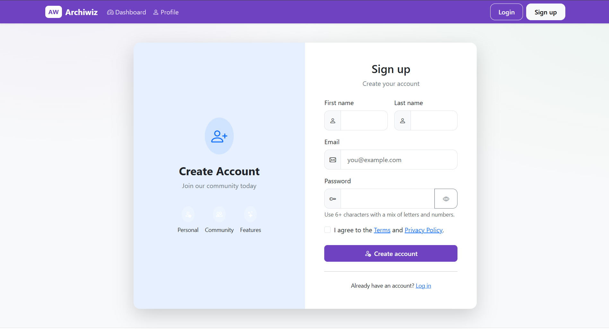
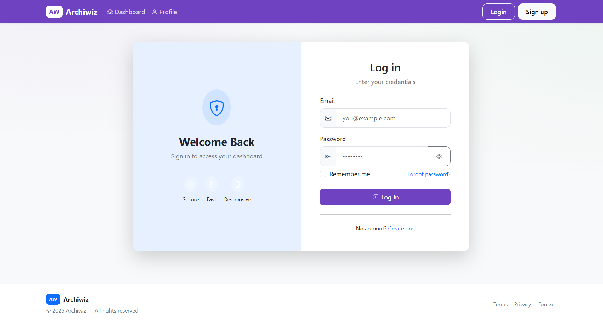
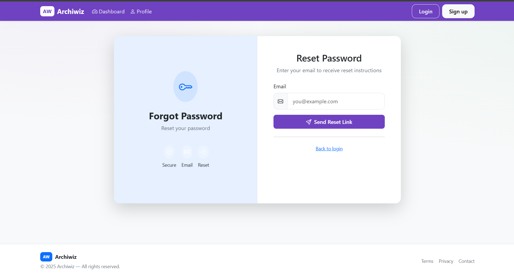
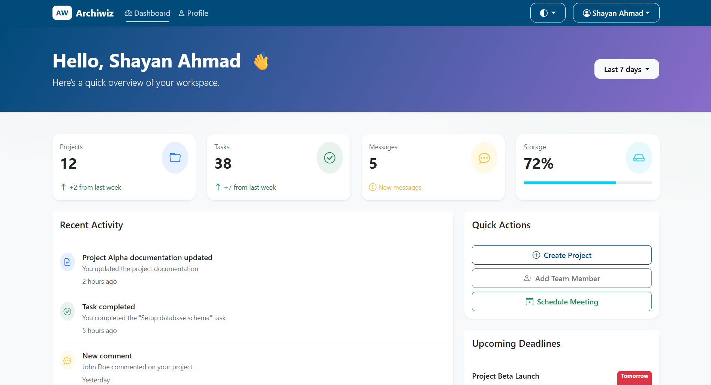
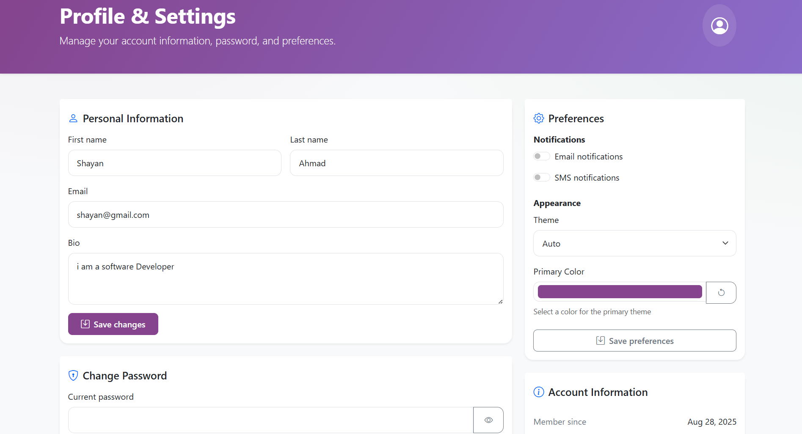

# Laravel Project Setup

This README will guide you through setting up and running the Laravel project locally.

## Prerequisites

Ensure the following tools are installed on your system:
🔧 Tech Stack:

-   PHP >= 8.2
-   Laravel = 12
-   Composer
-   Node.js >= 24.x
-   NPM >= 8.x
-   MySQL or any supported database

## Installation & Setup

Follow the steps below to get started:

```bash
# Clone the repository
git clone https://github.com/shayanahmad1999/laravel-bootstrap-custom-auth.git
cd laravel-bootstrap-custom-auth

# Install PHP dependencies
composer install

# Initialize and install Node.js dependencies
npm install

# Build frontend assets
npm run build

# Run the development server (optional during setup)
npm run dev

# Copy and set up the environment configuration
cp .env.example .env

# Generate application key
php artisan key:generate

# Run the development server
php artisan serve
npm run dev

```

---

## 📷 App Preview







---
